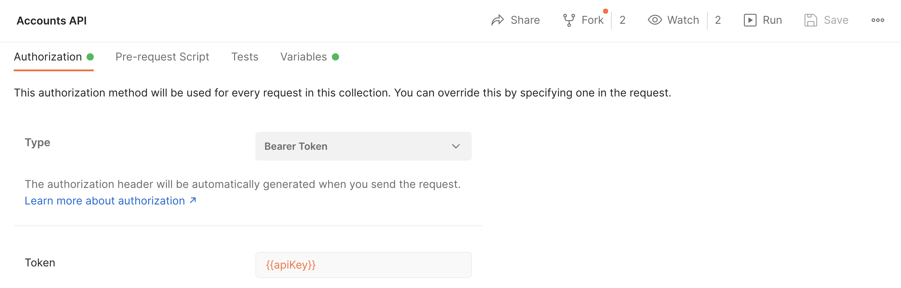

# Circle API Postman Collections
This repository contains all collections that Circle provides within the [Postman Circle Workspace](https://www.postman.com/circle-solutions/workspace/circle-developers/overview). This includes a collection for General, Core, Payments, Payouts, and Accounts API. Within each of these collections are folders that are organized one to one with how we organize our [API References](https://developers.circle.com/reference/). 

## Prerequisites
[Postman](https://www.getpostman.com/downloads/)

[Circle Sandbox Account](https://my-sandbox.circle.com/signup)
## Getting Started

### Import the collection file into your workspace
Within your Postman workspace select the Import button:

Then upload one or more of the Postman collections.
* [General API.postman_collection.json](./General API.postman_collection.json)
* [Core Functionality API.postman_collection.json](./Core Functionality API.postman_collection.json)
* [Payments API.postman_collection.json](./Payments API.postman_collection.json)
* [Payouts API.postman_collection.json](./Payouts API.postman_collection.json)
* [Accounts API.postman_collection.json](./Accounts API.postman_collection.json)

 

### Set your API key
For authorization, we have inserted the postman variable `apiKey`. Please add your base64 encoded bearer token to your environment or collection variables. Please see Postman’s [using variables](https://learning.postman.com/docs/sending-requests/variables/) for more information.

If you do not have an API Key head over to our Sandbox [signup form](https://my-sandbox.circle.com/signup).

## We want to hear from you
We want to hear how we can make the collection better! Don't hesitate to file [issues](https://github.com/circlefin/circle-postman/issues) for any bugs you encounters, features you'd like to see or other suggestions you have.
